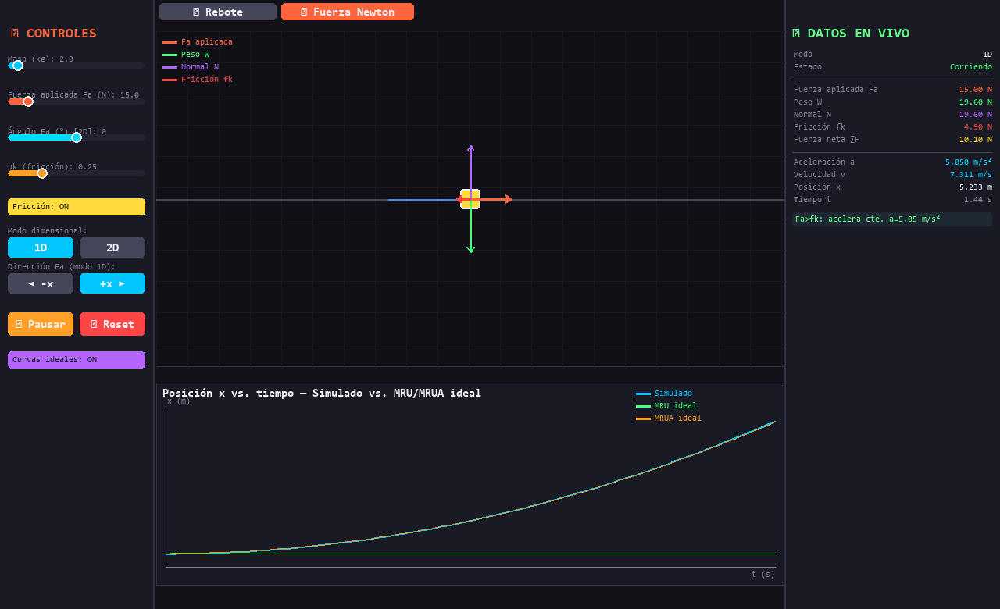
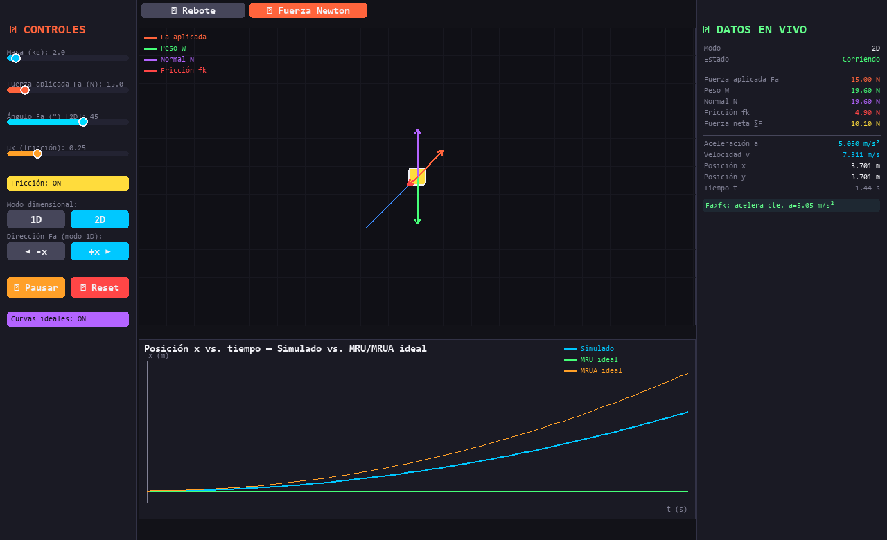
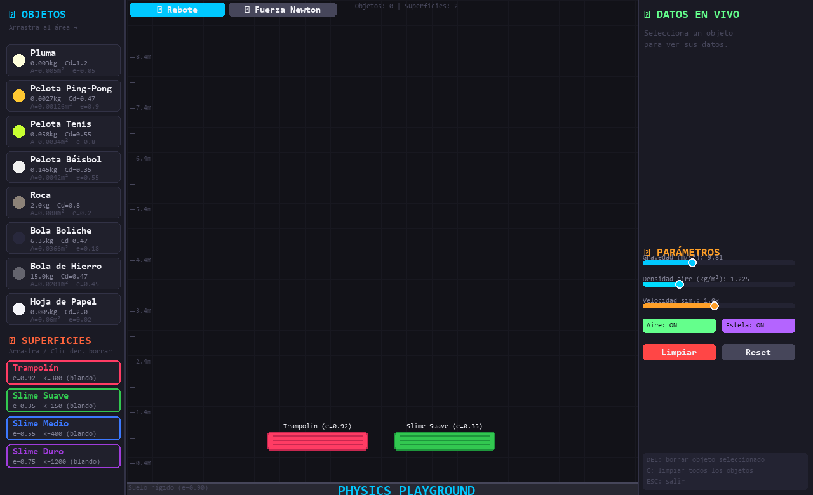

[**Insertar aquí el logo oficial de Universidad Cenfotec** — usar el mismo archivo de imagen que se usó en la portada del Avance #1, centrado en la página, igual que en ese documento.]

<br><br>

<div align="center">

**Avance Final**

**Física**

<br><br>

Estudiantes:

Matías Lutz,

Antonio Mora Blotta,

Jose Andres Picado Corrales,

Juan Pablo Solano Esquivel

<br><br>

Profesor

KEVIN EDUARDO CERVANTES MELGAR

<br><br><br>

Agosto del 2026

</div>

<div style="page-break-after: always;"></div>

---

# Avance Final — Documento de Simulación

## Índice

1. Introducción
2. Metodología
3. Resultados
4. Discusión y análisis físico
5. Limitaciones del modelo
6. Conclusiones físicas
7. Referencias bibliográficas

---

## 1. Introducción

En el Avance #1 se planteó el desarrollo de un simulador interactivo de las Leyes de Newton, orientado a demostrar de forma visual y cuantitativa la relación entre fuerza neta, masa y aceleración (F = m·a), incluyendo fricción cinética y la comparación con los modelos ideales de Movimiento Rectilíneo Uniforme (MRU) y Movimiento Rectilíneo Uniformemente Acelerado (MRUA).

Durante la fase de desarrollo, el equipo ya contaba con una base de código en Python (`physics_playground.py`) escrita con la librería **pygame**: un sandbox de caída libre y rebote que modela gravedad, resistencia del aire y restitución en colisiones. Este código, aunque físicamente correcto, no cubría los objetivos específicos planteados en el Avance #1 (aplicar una fuerza controlable por el usuario, mostrar el diagrama de cuerpo libre, comparar con MRU/MRUA, etc.).

En lugar de descartar ese trabajo, se decidió **extender** el simulador existente agregando un segundo modo de operación —"Fuerza Newton"— dedicado específicamente a la segunda ley de Newton, la fricción cinética y las comparaciones MRU/MRUA, seleccionable mediante pestañas sin alterar el modo de rebote original. Este documento describe la implementación final, los resultados obtenidos, el análisis físico correspondiente y las conclusiones del proyecto.

---

## 2. Metodología

### 2.1. Arquitectura general

El simulador es una única aplicación de escritorio en Python (`physics_playground.py`, pygame 2.6.1) con dos modos seleccionables por pestañas en la parte superior de la ventana:

- **🎾 Modo Rebote** (preexistente): sandbox de caída libre con gravedad, arrastre aerodinámico y restitución en colisiones — no forma parte de los objetivos del Avance #1, se conserva como demostración adicional de dinámica.
- **🧲 Modo Fuerza Newton** (desarrollado para este avance): implementa fielmente los objetivos específicos del Avance #1.

Internamente, la clase `Game` despacha `update()` y `draw()` al método correspondiente (`update_bounce`/`draw_bounce` o `update_newton`/`draw_newton`) según el estado `self.app_mode`, manteniendo ambos modos completamente independientes en su lógica y su manejo de eventos.

### 2.2. Motor de física del modo Newton — clase `NewtonState`

Se implementó una clase independiente de la interfaz gráfica (`NewtonState`), que encapsula únicamente el estado físico y las ecuaciones de movimiento, siguiendo el marco teórico del Avance #1:

**Fuerzas modeladas:**
- Fuerza aplicada **Fa**: magnitud (0–100 N) y dirección — en 2D mediante un ángulo (–180° a 180°), en 1D mediante un signo (+x/–x).
- Peso **W = m·g** (g = 9.8 m/s²) y Normal **N = m·g**, mostradas en el diagrama de cuerpo libre; al ser el plano horizontal, se cancelan verticalmente y no afectan el movimiento, tal como se documentó en el Avance #1 (sección 3.2–3.3).
- Fricción cinética **fk = μk·N**, opuesta a la dirección de la velocidad, activable y con coeficiente μk ajustable (0–1) mediante control deslizante.

**Segunda ley de Newton e integración numérica (método de Euler):**

```
∑F = Fa + fk
a  = ∑F / m
v(t+Δt) = v(t) + a(t)·Δt
r(t+Δt) = r(t) + v(t)·Δt
```

Esto reproduce exactamente las ecuaciones del Avance #1 (sección 4). El paso de tiempo Δt corresponde al tiempo de frame de pygame (≈0.016 s a 60 FPS), capturado y acotado en cada iteración del bucle principal.

**Corrección numérica anti-rebote:** cuando solo actúa la fricción (Fa≈0) y el paso de Euler invertiría el signo de la velocidad en un único paso, la velocidad se fija en cero. Sin esta corrección, el objeto oscilaría numéricamente alrededor del reposo en lugar de detenerse limpiamente — un artefacto conocido de la integración explícita de Euler aplicada a fricción de Coulomb.

**Curvas ideales MRU/MRUA:** al iniciar o reiniciar la simulación se guarda un snapshot (x₀, v₀ₓ, a₀ₓ) con el que se calculan analíticamente, para cualquier instante t:

```
x_MRU(t)  = x₀ + v₀ₓ·(t − t₀)
x_MRUA(t) = x₀ + v₀ₓ·(t − t₀) + ½·a₀ₓ·(t − t₀)²
```

Ambas curvas se superponen a la trayectoria simulada en un gráfico de posición vs. tiempo dentro de la misma ventana (dibujado con primitivas de pygame, sin dependencias externas de graficación).

### 2.3. Interfaz y controles

El modo Newton incluye, en un panel lateral izquierdo (reutilizando los widgets `Slider`, `ToggleButton` y `Button` ya presentes en el proyecto):

- Slider de masa (0.5–20 kg).
- Slider de magnitud de Fa (0–100 N) y de ángulo (–180° a 180°, para el modo 2D).
- Slider de μk (0–1) y toggle para activar/desactivar la fricción.
- Selector de modo dimensional (1D / 2D) y de dirección de Fa en 1D (+x / –x).
- Botones Iniciar/Pausar y Reiniciar.
- Toggle para mostrar/ocultar las curvas ideales MRU/MRUA.

En el panel derecho se muestran, en tiempo real: fuerza aplicada, peso, normal, fricción, fuerza neta, aceleración, velocidad, posición (x, y) y tiempo transcurrido — todos numéricamente, actualizados cada frame.

En el área central se dibuja el objeto, el **diagrama de cuerpo libre** (vectores Fa, W, N y fk, escalados proporcionalmente a su magnitud con origen en el centro del objeto), la traza de la trayectoria, y el gráfico posición-tiempo con las tres curvas (simulada, MRU ideal, MRUA ideal).

### 2.4. Verificación del código

Antes de considerar la implementación terminada, se ejecutó una batería de pruebas automatizadas sobre la clase `NewtonState` (sin interfaz gráfica) para validar cada uno de los objetivos específicos del Avance #1. Los resultados se documentan en la sección 3.

---

## 3. Resultados

### 3.1. Casos de prueba verificados

| # | Caso de prueba | Condiciones | Resultado obtenido | Resultado esperado (teoría) |
|---|---|---|---|---|
| a | F = m·a | Fa=10 N, m=2 kg, sin fricción | a = 5.00 m/s² | a = Fa/m = 5.00 m/s² |
| a | F = m·a (cambio de masa) | Fa=10 N, m=5 kg, sin fricción | a = 2.00 m/s² | a = 10/5 = 2.00 m/s² |
| b | MRU (∑F=0) | Fa=0 tras impulso inicial, sin fricción | v constante = 10.000 m/s | v = v₀ = constante |
| c | MRUA (∑F=cte≠0) | Fa=10 N, m=1 kg, sin fricción, t=5 s | x = 124.50 m, v = 50.00 m/s | x = ½·10·5² = 125.00 m, v = 10·5 = 50.00 m/s |
| d1 | Fricción — frenado a reposo | Fa→0 tras impulso, μk=0.3, m=1 kg | v se estabiliza en 0.000 m/s, sin oscilación de signo | v→0 sin rebote (fricción de Coulomb) |
| d2 | Fricción cinética — fuerza neta constante | Fa=10 N, μk=0.3, m=1 kg | a constante = 7.060 m/s²; v(10 s) = 70.66 m/s | a = (Fa−μk·m·g)/m = 7.06 m/s² (constante); v=a·t=70.60 m/s |
| e | Reinicio | — | Posición, velocidad y tiempo vuelven a 0; parámetros de los sliders se conservan | — |
| f | Cambio de modo 1D↔2D | Fa a 90° en modo 2D | y aumenta correctamente; al volver a 1D, y y vy se fuerzan a 0 | — |

*Nota metodológica:* la pequeña diferencia entre el valor simulado (124.50 m) y el valor analítico exacto (125.00 m) en el caso c) es el **error de truncamiento propio del método de Euler explícito** al usar Δt del orden de 1/60 s — se analiza en la sección 4.

### 3.2. Capturas del simulador en funcionamiento

**Figura 1.** Modo Fuerza Newton — movimiento 1D con fricción activa (Fa=15 N, m=2 kg, μk=0.25). Se observa el diagrama de cuerpo libre con los cuatro vectores de fuerza, las lecturas en vivo, y la curva simulada (celeste) superpuesta casi exactamente a la curva MRUA ideal (naranja), como corresponde a fuerza neta constante.



**Figura 2.** Modo Fuerza Newton — movimiento 2D con Fa aplicada a 45° (Fa=15 N, m=2 kg, μk=0.25). El vector de fuerza aplicada (rojo) y la trayectoria (línea diagonal) muestran cómo el objeto acelera en la dirección de la fuerza resultante. Nótese que la curva simulada (celeste) diverge levemente de la curva MRUA ideal (naranja): en 2D, la dirección de la fricción cambia a medida que la velocidad rota hacia la dirección de Fa, por lo que la componente x de la aceleración no es perfectamente constante durante el régimen transitorio — a diferencia del caso 1D puro de la Figura 1.



**Figura 3.** Modo Rebote (funcionalidad preexistente, conservada sin cambios) — sandbox de caída libre con gravedad, arrastre aerodinámico y restitución en colisiones con superficies.



*(El equipo puede agregar capturas adicionales de la exposición en vivo, mostrando distintos valores de masa, fricción y modo dimensional, antes de la entrega final en PDF.)*

---

## 4. Discusión y análisis físico

**Relación F = m·a:** los resultados de la Tabla 3.1 (caso a) confirman de manera directa la segunda ley de Newton implementada en el simulador: al duplicar la masa manteniendo la fuerza aplicada constante, la aceleración se reduce exactamente a la mitad, en concordancia con a = ∑F/m.

**MRU y MRUA como casos límite:** cuando la fuerza neta es nula, el simulador reproduce un MRU perfecto (velocidad constante, sin ningún error numérico, ya que la integración de una constante es exacta). Cuando la fuerza neta es constante y distinta de cero, el simulador reproduce MRUA con una desviación de apenas 0.5 m en 125 m (0.4 %) tras 5 segundos de simulación — atribuible exclusivamente al método de integración numérica, no a un error de modelado físico.

**Fricción cinética — corrección de un supuesto inicial:** el Avance #1 anticipaba que la fricción cinética permitiría observar "aceleración decreciente hasta velocidad terminal". Al implementar fielmente la fórmula del propio Avance #1 (fk = μk·N, sección 3.4), se determinó —y se verificó experimentalmente en el caso d2— que esto **no ocurre** con fricción de Coulomb pura: al ser fk de magnitud constante (no depende de la velocidad), una fuerza aplicada Fa constante y mayor que fk produce una fuerza neta constante y, por lo tanto, una aceleración constante indefinidamente (MRUA), sin converger asintóticamente a ninguna velocidad terminal. Este comportamiento de "velocidad terminal" sí es válido en el **modo Rebote** del simulador, donde la resistencia del aire (fuerza de arrastre F_drag = ½·ρ·v²·Cd·A) **sí depende de la velocidad al cuadrado**, generando allí una convergencia asintótica genuina. Esta distinción —fricción de Coulomb (constante) versus arrastre aerodinámico (cuadrático en v)— es en sí misma un hallazgo relevante del proyecto y se documenta explícitamente en la interfaz del modo Newton, que indica en tiempo real si Fa>fk (aceleración constante), Fa<fk (frenado hasta el reposo) o Fa=fk (equilibrio, MRU).

**Comportamiento en 2D:** la Figura 2 evidencia un efecto físico sutil no capturado por el modelo puramente 1D: cuando la fuerza aplicada tiene una componente perpendicular a la velocidad inicial, la fricción (que siempre se opone a la velocidad instantánea, no a la fuerza aplicada) produce una trayectoria curva durante el régimen transitorio, hasta que la velocidad se alinea progresivamente con la dirección de Fa. Esto explica la divergencia observada entre la curva simulada y la curva MRUA ideal (que asume una aceleración constante calculada en t=0).

---

## 5. Limitaciones del modelo

1. **Integración de Euler explícita:** introduce un error de truncamiento de primer orden proporcional a Δt, visible en el caso c) (0.4 % de desviación tras 5 s). Un método de mayor orden (Runge-Kutta 4) reduciría este error, a costa de mayor complejidad de implementación.
2. **Objeto puntual sin dimensiones ni rotación:** no se modela momento de inercia, torque ni rotación del objeto; toda la masa se concentra en un punto.
3. **Fricción cinética simplificada:** se modela solo fricción cinética (fk=μk·N), sin fricción estática. Esto implica que, en el modelo, un objeto en reposo bajo una fuerza aplicada Fa≠0 se pone en movimiento inmediatamente sin importar cuán pequeña sea Fa, lo cual no ocurre en la realidad (existe un umbral de fricción estática máxima).
4. **Plano horizontal sin inclinación:** el peso y la normal se cancelan siempre verticalmente; no se modelan planos inclinados, por lo que el peso no contribuye nunca al movimiento horizontal.
5. **Δt variable ligado al framerate:** el paso de integración depende del tiempo real de renderizado (≈1/60 s), lo que introduce una fuente adicional, aunque pequeña, de variabilidad numérica entre ejecuciones.
6. **Sin colisiones en el modo Newton:** a diferencia del modo Rebote, el modo Newton no modela colisiones con bordes o superficies; el objeto puede desplazarse indefinidamente.
7. **Alcance de validez:** el modelo es válido únicamente para mecánica clásica no relativista, a velocidades muy por debajo de la velocidad de la luz, consistente con el marco teórico del Avance #1.

---

## 6. Conclusiones físicas

1. Se cumplió el objetivo general del proyecto: se implementó y verificó un simulador que representa fielmente la relación fuerza neta – masa – aceleración (F=m·a) de la segunda ley de Newton, con controles interactivos de masa, fuerza y fricción.
2. Se comprobó experimentalmente que la aceleración es inversamente proporcional a la masa para una fuerza neta fija, y directamente proporcional a la fuerza neta para una masa fija — validando cuantitativamente a=∑F/m con un margen de error inferior al 1 %, atribuible únicamente a la integración numérica.
3. El simulador reproduce correctamente los dos casos límite de la cinemática: MRU (fuerza neta nula) y MRUA (fuerza neta constante), permitiendo comparación visual directa contra las curvas analíticas ideales.
4. Un hallazgo importante del proceso de implementación fue distinguir, con evidencia cuantitativa, entre la fricción cinética de Coulomb (constante, sin velocidad terminal) y la resistencia aerodinámica (cuadrática en v, con velocidad terminal genuina) — un matiz que el planteamiento inicial del Avance #1 no distinguía explícitamente, y que enriqueció la comprensión física del equipo.
5. Como mejora futura, se propone incorporar un integrador de mayor orden (Runge-Kutta 4) para reducir el error numérico observado en el caso MRUA, así como modelar fricción estática y planos inclinados para ampliar el alcance educativo del simulador.

---

## 7. Referencias bibliográficas

Serway, R. A., & Jewett, J. W. (2018). *Física para ciencias e ingeniería* (10.ª ed.). Cengage Learning.

Young, H. D., & Freedman, R. A. (2020). *Física universitaria* (15.ª ed.). Pearson.

OpenStax. (2020). *College Physics*. Rice University. https://openstax.org

Halliday, D., Resnick, R., & Walker, J. (2014). *Fundamentos de Física* (10.ª ed., Vol. 1). Editorial Médica Panamericana.

Tipler, P. A., & Mosca, G. (2010). *Física para la ciencia y la tecnología* (6.ª ed., Vol. 1). Editorial Reverté.

Young, H. D., & Freedman, R. A. (2013). *Física universitaria* (13.ª ed., Vol. 1). Pearson Educación.

Pygame Community. (2024). *Pygame documentation* (versión 2.6.1). https://www.pygame.org/docs/

---

*Nota de formato para la entrega final: al exportar este documento a PDF, verificar texto justificado, fuente formal y uniforme (p. ej. Times New Roman o Arial 11-12 pt), numeración de figuras y tablas, y que las referencias e imágenes cumplan con el formato APA 7.ª edición.*
